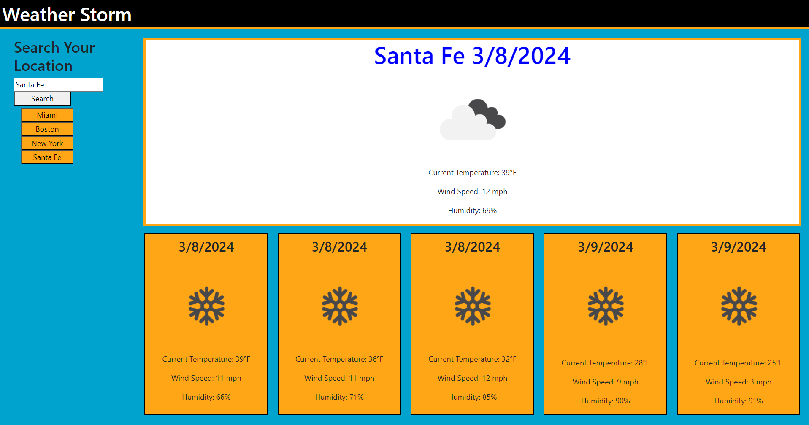

# weather-storm
The Weather Storm application was intended to showcase the work of Sawyer Baldwin through the first third of the bootcamp course.

## Description
The weather application was inteded to provide users with a way to view the weather in their slected city. To complete this, I had to use my knowledge of front end functionality.

## Usage
The Weather Storm app is used by typing in and searching for a specific city. When searched the page will update with the current day forcast and a five day forcast including the weather, temperature, wund, and humidity. Once searched, the application will save previously searched cities in recent searches to be selected again.

## Conclusion
During the creation of this application we learned and sharpened many coding skills that will be invaluable in future jobs involving computer software engineering and design. The skills used/learned include:

* Learned to further implement Javascript, CSS, and HTML.

* Further explanded my knowledge of JQuery and how it can manipulate JavaScript functionality.

* Gained a better understanding of the use of thrid party api's

* Acheieved a more through knowledge of local storage.

* Implemented some Bootstrap functionality

## Screenshot

## Links
https://github.com/baldwisj/weather-storm

https://baldwisj.github.io/weather-storm/
